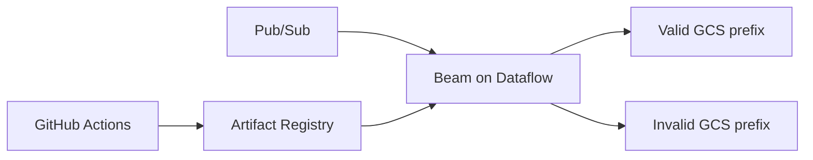

# GCP Dataflow Flex Template CI/CD

A generic streaming delivery system that packages an Apache Beam pipeline as an immutable Dataflow Flex Template and safely replaces an existing environment-specific job during deployment.

## Portfolio evidence

| Capability | Implementation |
| --- | --- |
| Streaming | Pub/Sub input with Apache Beam |
| Data quality | JSON parsing, required-field validation and valid/invalid routing |
| Observability | Beam counters for processed, valid and invalid records |
| Packaging | Python 3.12 Dataflow Flex Template container |
| Infrastructure | Terraform for APIs, Artifact Registry, GCS, Pub/Sub, IAM and worker identity |
| CI | Lint, unit tests, container build, Terraform validation and shell validation |
| CD | OIDC authentication, immutable SHA versioning and environment controls |
| Lifecycle | Detect active job, cancel, wait for terminal state and redeploy |
| Security | No environment files or long-lived cloud credentials in the image/repository |

## Architecture



## Local validation

```bash
python -m venv .venv
source .venv/bin/activate
pip install -r requirements-dev.txt
ruff check pipeline tests
pytest -q
```

The transform tests use Beam's local test runner and do not require a GCP account.

## Cloud release

Provision the baseline resources from `infra/terraform`, configure protected GitHub environments, and provide workload-identity settings plus non-secret environment variables. Then run **Build Flex Template** manually.

Cloud resources can incur charges. The release workflow is intentionally manual and does not run from an ordinary push.

See [deployment lifecycle](docs/deployment-lifecycle.md) for job-replacement behavior and trade-offs.

## Production extensions

- dead-letter Pub/Sub publishing instead of file-only invalid routing
- schema registry or protobuf validation
- CMEK and VPC Service Controls
- Dataflow Prime and right-sizing policies
- alerting on system lag, failed bundles and invalid-event ratio
- drain/update strategy for zero-interruption releases

