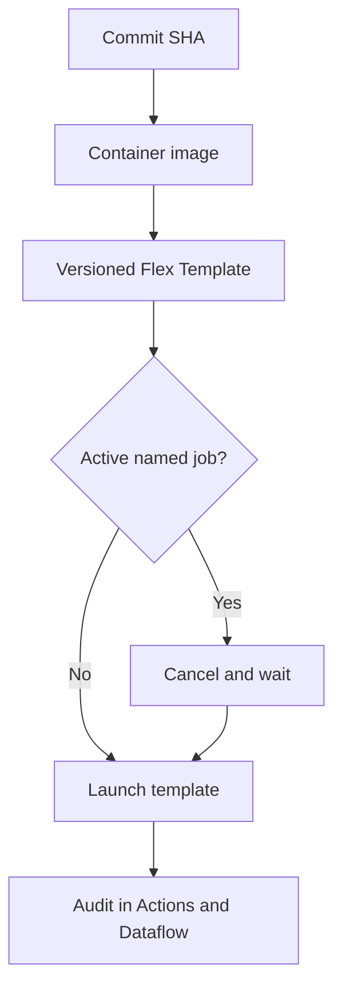

# Deployment lifecycle

The release workflow follows an immutable build and controlled replacement model:

## Why cancel and recreate?

Streaming Dataflow jobs cannot be launched twice with the same active job name. The script resolves the current job by exact environment-specific name, captures its ID in logs, requests cancellation, waits for a terminal state and only then launches the immutable template version.

For production workloads that cannot tolerate interruption, a drain/update strategy may be more appropriate. That choice depends on state compatibility, duplicate-processing tolerance and the release SLO.

## Configuration boundary

The image contains application code and Python dependencies only. Environment-specific subscriptions, buckets, networks, service accounts and worker settings enter at deployment time. No `.env` file is copied into the image.

